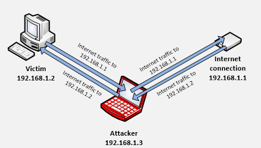
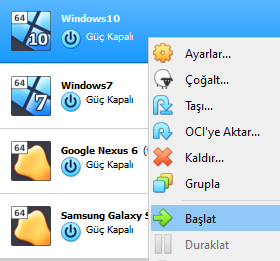
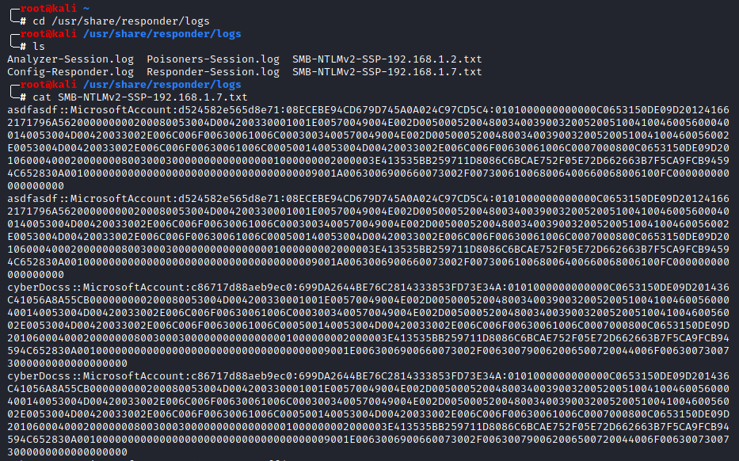

# Network Güvenliği

# 1. ARP Zehirlenmesi [ARP Poisoning]

## 1.1 ARP Protokolü Nedir
* ARP, Adres Çözümleme Protokolü demektir. Yerel ağda IP adresi bilinen cihazın MAC adresini bulmak için kullanılır. Ağa bağlı olan bilgisayarlar birbirleri ile MAC adresleri üzerinden iletişim kurarlar. IP’sini bildiği bir bilgisayara bir paket gönderileceği zaman, kaynak(Source) cihaz ARP tablosuna bakar ve hedef(Destination) cihazın MAC adresinin ARP tablosunda olup olmadığını kontrol eder. Eğer ARP tablosunda, hedef cihazın MAC adresi bulunmuyorsa, ARP protokolü çalışır ve IP’sini bildiği cihazın MAC adresini öğrenmek için bulunduğu ağa bir ARP İstek(Request) paketi gönderir. ARP isteğinin(Request) paketinin içinde, MAC adresini öğrenmek istediği cihazın IP adresi bulunur. ARP İsteğini ağdaki tüm cihazlar alır, IP’nin kendisine ait olmadığını anlayan cihazlar ARP Request paketlerini siler. IP adresinin kendisine ait olduğunu anlayan cihaz Request paketini alır açar ve MAC Adresi bilgisini, ARP Cevap(Reply) paketi ile kaynak cihaza gönderir.

## 1.2 ARP Zehirlenmesi Nedir
* Saldırgan, sahte ARP Reply paketlerini, broadcast olarak yerel ağa sürekli gönderir. Hedefine gitmek isteyen cihaz ARP Request talebinde bulunduğu anda, cevap olarak saldırgandan gelen ARP Reply paketini alır. Saldırgan kendini Gateway gibi gösterir ve internete çıkacak kurbanlar, saldırganın cihazı üzerinden internete çıkar. Bu sayede kurbanın tüm trafiğini izleyebilme, verilere erişebilme şansına sahip olur. Bu nedenle ARP Spoofing, MITM(Man in the Middle/Aradaki Adam) saldırıları arasında yer alır.

## 1.3 Zafiyeti Sömürme
* Adım 1: Saldırgan Cihazı
	- Bağlı olduğumuz ağdaki Gateway adresimizi ve MAC adresimizi öğrenelim.
	
* Adım 2: Kurban Cihazı
	- ARP tablomuzu görüntüleyelim ve Gateway adresimizin MAC adresini öğrenelim. ARP Zehirlenmesi sonrası Gateway MAC adresinin, Saldırgan Cihazın MAC adresi ile değiştiğini göreceğiz.  
	
* Adım 3: Saldırgan Cihazı
	- MITMf tool’unu kullanarak ARP Zehirlenmesi atağını gerçekleştireceğiz.
	- python mitmf.py --spoof --arp --gateway <GatewayIPAdresi> --target <HedefCihazIPAdresi> -i <interface>
	
* Adım 4: Kurban Cihazı
	- Saldırı başladktan sonra ARP tablomuzu görüntülüyoruz. Gateway MAC adresinin, Saldırgan cihazın MAC adresi ile değiştiğini görmekteyiz.
	- ARP Zehirlemesi saldırısı başarı ile gerçekleşti. Artk kurban cihazında yapılan trafikler, saldırgan kişi tarafından görüntülenebilmektedir.
	
* Adım 5: Saldırgan Cihazı
	- MITMf tool'u arayüzünde, kurban cihazında yapılan trafikler, HTTP servisi üzerinden giden kullanıcı adı & parola değerleri görüntülenebilmektedir.
	- Ayrıca Wireshark vb. gibi network paket analizi yapılabilen araçlar ile kurbanın yapacağı tüm trafikler, kullanıcı adı parola bilgileri vb. detaylı olarak incelenebilir.  
	

# 2. DHCP Spoofing

## 2.1 DHCP Protokolü Nedir
* DHCP (Dynamic Host Configuration Protocol), Network üzerinde istemcilere (bilgisayarlar, sunucular vb.) kendi IP havuzundan otomatik olarak IP atayan & tanımlayan protokoldür. Günümüzde networklere bağlanan cihazlar giderek arttığı için dolayısıyla hepsine manuel olarak IP atamakta zorlaştığı için geliştirilen bir protokoldür. DHCP protokolü genellikle 67. Port üzerinde çalışmaktadır. 

## 2.2 DHCP Spoofing Nedir
* OSI modelinin 2. Katmanında gerçekleşen bir saldırı türüdür. Saldırgan, bir script & tool yardımı ile kendini sahte bir DHCP sunucusu gibi gösterir. Bunu başarabilmek için bağlı olduğu networke sürekli DHCP Offer paketleri gönderir.

## 2.3 DHCP Spoofing Gerçekleşme Adımları
* 1: Kendini DHCP sunucusu gibi tanıtacak olan Saldırgan, bulunduğu ağa sürekli broadcast olarak DHCP Offer paketleri gönderir. Bu DHCP Offer paketlerinin içerisinde ki ağ bilgilerini Gateway adresi kendi IP’si olacak şekilde değiştirir.
* 2: IP almak isteyen Kurban, bulunduğu ağa IP almak istediğini belirten DHCP Discover(Keşif) paketi gönderir ve DHCP Offer paketi almak için etrafını dinlemeye başlar.
* 3: Saldırganın sürekli ağa yaymış olduğu DHCP Offer paketini alan Kurban, saldırgana yani sahte DHCP sunucusuna IP almak istediğini belirten DHCP Request paketini gönderir.
* 4: Saldırgan bunun üzerine kurbana bir DHCP Acknowledgement paketi gönderir ve işlem sona ermiş olur.
* 5: Artık saldırgan kendi IP’sini Gateway gibi gösterdiği için, kurbanın yapacağı trafikler Saldırgan cihazı üzerinden geçecek. Veri alınıp-gönderilirken şifrelenmeyen veya basit şifrelenen tüm verileri saldırgan tarafından okunabilir ve erişilebilir durumda olacaktır.

## 2.4 Zafiyeti Sömürme

* Adım 1: Saldırgan Cihazı
	- Saldırgan cihazının IP adresini öğrenelim.  
	
* Adım 2: Saldırgan Cihazı
	- MITMf tool'unu kullanarak DHCP Spoofing saldırısını gerçekleştireceğiz ve sonrasında dahil olduğumuz ağda bir DHCP Discover paketi gelmesini bekleyeceğiz.
	- python mitmf.py -i <interface> --spoof --dhcp  
	
* Adım 3: Kurban Cihazı
	- Kurban cihazı başlatarak DHCP'den IP talep etmesini sağlıyoruz.  
	
* Adım 4: Saldırgan Cihazı
	- Kurban cihazı, IP almak isteyeceği için bulunduğu network’e DHCP Discover paketi gönderiyor. Cevap olarak bizden DHCP Offer paketini alıyor, sonrasında bize DHCP Request paketini gönderiyor. Sonrasında kurbana DHCP Acknowledgement paketini gönderiyoruz ve işlem tamamlanıyor!
	
* Adım 5: Kurban Cihazı
	- Kurban cihazında Gateway’ın IP adresine baktığımızda, Default Gateway’ın bizim saldırgan makinemizin IP’si olduğunu görüyoruz.
	
* Adım 6: Saldırgan Cihazı
	- Artık kurban cihazı üzerinde yapılacak olan trafikler ilk olarak saldırgan cihazı üzerinden geçeceği için saldırının başlatıldğı MITMf konsolunda bu istekler ve yapılan trafik görüntülenmektedir. 
	- Ayrıca Wireshark vb. gibi network paket analizi yapılabilen araçlar ile kurbanın yapacağı tüm trafikler, kullanıcı adı parola bilgileri vb. detaylı olarak incelenebilir.  
	

## 2.5 DHCP Spoofing Saldırısına Önlem Aşamasında
* Network üzerinde broadcast olarak paket paylaşımı engellenebilir
* Switch üzerinde DHCP Snooping özelliği aktif edilebilir

## 2.6 DHCP Snooping Nedir
* Layer 2 Switch’imizde DHCP Snooping’i aktif ettiğimizde tüm portlar untrusted(Güvenilmeyen) moda geçer. Bu sayede untrusted portlar üzerinden gelen DHCP Sunucu Paketleri(Offer, Acknowledgement) Switch’imiz tarafından DROP hale getiriliyor böylelikle bu paketler son kullanıcıya ulaşamıyor.
DHCP Snooping özelliğini aktif hale getirdikten sonra gerçek DHCP sunucumuzun hangi port üzerinden paketler göndereceğini Switch’imize belirtip o portu trust(Güvenilir) hale getiriyoruz. Bu trust portlar üzerinden DHCP Sunucu Paketleri son kullanıcımıza iletilebiliyor. Şöyle ki ;

* Görselden anlaşılacağı üzere DHCP İstemci Paketleri(Discover, Request) unTrust port üzerinden broadcast olarak ağa iletilebiliyor. Fakat bu paketlere cevap olarak gönderilecek olan DHCP Sunucu Paketleri(Offer, Acknowledgement) sadece Trust portlar üzerinden geliyorsa son kullanıcıya ulaşabiliyor.

# 3. LLMNR & NBT-NS Zehirlenmesi [LLMNR Poisoning]

## 3.1 LLMNR (Link-Local Multicast Name Resolution) Nedir
* Aynı yerel bağlantıdaki bilgisayarlar için isim çözümlemesi yapmalarına olanak tanıyan DNS bazlı bir protokoldür. Sıklıkla TCP&UDP/5355. Portta çalışmaktadır.

## 3.2 mDNS (Multicast DNS) Nedir
* Yerel bir DNS sunucusunun bulunmadığı küçük ağlarda, isim çözümlemesi görevini üstlenen bir protokoldür.

## 3.3 NBT-NS (NetBIOS Name Server) Nedir
* Diğerlerine benzer şekilde, host kimliği belirlemede kullanılan Microsoft Windows’un alternatif bir bileşenidir. Sıklıkla TCP&UDP/137. Portta çalışmaktadır.

## 3.4 NTLMv2Hash Nedir
* Kullanıcı parolaları geri döndürülemez fonksiyonlardan geçirilerek, elde edilen parola özetleri(hash) formatında saklanırlar. NTLMv2 parola hash formatı ise Windows işletim sistemlerinde istemcilere ait parolaların ilgili işlemler sonrası elde edilen özet halidir ve SAM dosyasında saklanmaktadır.

## 3.5 LLMNR & NBT-NS Zehirlenmesi Nedir
* Saldırgan, ağdaki erişim isteklerini dinlemeye başlar ve broadcast olarak ağa paketler gönderir. Kurban, ağda bulunmayan ve DNS sunucusu kayıtlarında olmayan bir cihaza erişim isteğinde bulunur. DNS sunucusundan, böyle bir kayıt olmadığına dair yanıt aldıktan sonra, kurban tarafından tüm ağa bu sunucuyu bilen birinin olup olmadığı sorulur. Tam o sırada saldırgan, bu isteğe yanıt verir. Kurban kimlik bilgilerini ve NTLMv2Hash değerini saldırgana iletir. Bu sayede saldırgan parola hash’ini ele geçirmiş olur.

## 3.6 Örnek bir senaryoda LLMNR Zehirlenmesi
* Bir cihaz, bir sunucuya gitmeye çalışıyor diye varsayalım. Gideceği yer aslında “\\cyberDocs” sunucusu iken kurbanın erişmek için yazdığı “\\cyberDocss” oluyor. DNS, cihaza böyle bir sunucu bulamadığının yanıtını gönderiyor. Cihaz, yerel ağında bulunan diğer cihazlara “\\cyberDocss” sunucusunun adresini bilen var mı diye istek gönderiyor. Saldırgan bu aşamada, bu “\\cyberDocss” sunucusuna ait diye kurbana bir adres gönderiyor. Kurban ise saldırgana kendi kullanıcı adını ve NTLMv2 hashini gönderiyor.

## 3.7 Zafiyeti Sömürme
* Adım 1: Saldırgan Cihazı
	- Responder tool'unu başlatıyoruz.
	- responder -I <interface> -rdw  
	
* Adım 2: Kurban Cihazı
	- Var olmayan bir sunucuya bağlantı yapmayı deniyoruz.  
	
* Adım 3: Saldırgan Cihazı
	- Kurban cihazda yapılan yanlış sunucuya gitme işlemi sonrasında, responder yazılımımızın sürekli(broadcast) olarak ağa gönderdiği paketleri kurban cihaz alır ve kullanıcı adı, parola hashi bilgilerini saldırgan cihazına yollar.  
	
* Adım 4: Saldırgan Cihazı
	- Elde edilen tüm parola hashleri "/usr/share/responder/logs" altında görüntülenebilir.  
	

