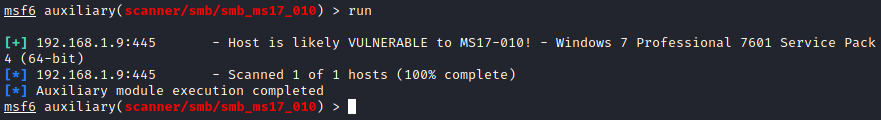

# Windows Sistemler

# 1. MS17-010 (CVE-2017-0144)

## 1.1 MS17-010 Zafiyeti Nedir
* Bu güvenlik açığının başrolü olan “WannaCry” fidye yazılımı, kurbanlarına Microsoft Windows’un “SMB” protokolünde bulunan güvenlik açığından faydalanarak bulaşmaktadır. Kullanılan “EternalBlue & Doublepulsar” adlı exploit, SMB üzerinden “DLL Injection” yaparak hedef cihaza sızmayı sağlamaktadır. 14 Nisan 2017’de “ShadowBrokers” tarafından NSA’in hacking araçlarının ifşa edilmesiyle ortaya çıkmıştır. Bu güvenlik açığı sömürülerek zafiyetli sistem üzerinde uzaktan kod çalıştırma(Remote Code Execution) mümkün olmaktadır. Doublepulsar ise Windows sistemlerde arkakapı(backdoor) erişimi yaratmakta yardımcı olmaktadır.

## 1.2 DLL Injection Nedir
* İçerisinde önemli kod satırlarını barındıran ve işletim sistemi ya da yazılımların çalışması için gerekli olan fonksiyonları bulunduran “DLL” dosyalarına farklı-zararlı kodların enjekte edilmesi durumudur. Saldırgan 3.parti bir yazılım veya benzeri yöntemlerden faydalanarak kendi zararlı kodunu sistem içerisinde yer alan herhangi bir DLL dosyasının içine enjekte eder. DLL dosyasının içerisinde yer alan kodlar hem yüksek izin yetkisiyle çalışmayı başaracak hem de Windows veya yazılımın sistemden tamamen temizlenene kadar işlevini yürütmeye devam edecektir.

## 1.3 Zafiyeti Tespit Etme
* Nmap ile zafiyet tespiti
	- nmap -p 445 --script smb-vuln-ms17-010 <HedefCihazIPAdresi>  
	
* Msfconsole ile zafiyet tespiti
	- use auxiliary/scanner/smb/smb_ms17_010
	

## 1.4 Zafiyeti Sömürme
* Msfconsole ile zafiyet sömürme
	- use exploit/windows/smb/ms17-010_eternalblue
	

# 2. DLL Hijacking

## 2.1 DLL Dosyaları Nedir
* DLL dosyaları, içerisinde bulundurduğu kod satırları ve fonksiyonlar ile sahibi olan programın&yazılımın çalışmasını ve işlevini yerine getirebilmesini sağlar. Çalışacak olan programlar (örneğin .exe dosyaları) gerektiğinde bu DLL dosyalarını kullanarak işlevlerini yerine getirirler.

## 2.2 DLL Hijacking Nedir
* Bu saldırıda saldırgan, DLL’in arandığı dizinleri bulur. Aranılan DLL dosyası, arandığı ilk dizinde değil ise : zararlı DLL dosyası oluşturularak arandığı ilk dizine yerleştirilir. Bu sayede kurban “baris.exe” programını çalıştırmak istediğinde sistem gerçek baris.DLL yerine, zararlı payload’ı içeren DLL dosyası olan baris.DLL dosyasını çalıştırmış olur.
* Programların çalışabilmesi için gerekli olan DLL dosyalarının tam bir konumu belirtilmez. Windows, DLL Arama Sırası ile DLL dosyasını arar, bulur ve çalıştırır. DLL arama sırası aşağıdaki gibidir:
	- 1. Uygulamanın yüklendiği dizin
	- 2. Sistem dizini
	- 3. 16-bit sistem dizini
	- 4. Windows dizini
	- 5. Geçerli çalışma dizini (CWD)
	- 6. PATH ortam değişkeninde listelenen dizinler
	- Kaynak: https://support.microsoft.com/tr-tr/help/2389418/secure-loading-of-libraries-to-prevent-dll-preloading-attacks

## 2.3 Saldırı Senaryosu
* Örnek bir saldırı senaryosunda, düşük yetkili bir kullanıcı ile bir sisteme sızdığımızı varsayalım. Ve bu sistemde zararlı DLL dosyamızı çalıştırabilmeyi istiyoruz. CMD kod satırında, “icacls” komutu ile birlikte hangi dizinlerde hangi yetkilere sahip olduğumuzu sorgulamakla başlayabiliriz. Sistemde yetkili bir kullanıcı olmadığımız için zararlımızı sisteme etki edebilecek şekilde çalıştıramayabiliriz.

	

* Bu komut ile, CMD’yi hangi kullanıcı ile açtıysak ve hangi dizini belirttiysek o dizin üzerinde hangi yetkilere sahip olduğumuzu görüntüleyebiliyoruz. Hatta erişimimiz var ise seçtiğimiz dosyalarda kendimize yazma&okuma vs. yetkileri de verebiliriz.
Örnek kullanımlar ve detaylı bilgilendirme için Microsoftun hazırladığı dökümana göz gezdirebilirsiniz:
	- https://docs.microsoft.com/en-us/windows-server/administration/windows-commands/icacls

* Sonrasında AccessChk tool’unu kullanarak sızmış olduğumuz sistemde, seçtiğimiz kullanıcı tipi ile hangi dizinlerde yazma, okuma izinlerimizin olduğunu öğrenebiliriz.

	

* Örneğin bu komut ile, sistemde “Authenticated Users” yetkisine sahip olan kullanıcıların hangi dizinlerde yazma yetkileri vs. olduğunu sorgulattık. Bu komut satırında ki -u, -w, -d ve diğer parametrelerin ne işe yaradığını ve nasıl kullanılabileceğine göz gezdirmek için Microsoftun hazırlamış olduğu dökümana göz gezdirebilirsiniz:
	- https://docs.microsoft.com/en-us/sysinternals/downloads/accesschk

* Sahip olduğumuz kullanıcıda hangi yetkilere sahip olduğumuzu öğrendik. Hangi tipte olan kullanıcıların(System, Administrator,User) hangi dizinlerde ne yetkileri olduğunu da görüntüledik. Yeteri kadar bilgiyi topladığımızı düşünüyorum. Artık saldırı vektörümüze geçiş yapabiliriz.

* DLL Hijacking saldırısı için “Siofra” tool’unu kullanacağız.

## 2.4 Zafiyeti Sömürme
* Adım 1:
	- İlk olarak DLL Hijacking zafiyeti içeren bir program seçmemiz gerekiyor. Bu senaryoda sistemde yetkimizin olduğu klasörlerdeki programları aramamız en mantıklısı olacaktır. Kullanacağım komut ise:
	Siofra64.exe –mode file-scan -f ” C:\Program Files\Internet Explorer\iexplorer.exe” –enum-dependency –dll-hijack
	- Bu komut ile seçmiş olduğum .exe dosyasının kullanacağı DLL dosyalarını hangi dizinde aradığını ve aslında DLL dosyasının hangi dizinde olduğuna bakıyor ve buna göre bir zafiyet içeriyorsa bize Vulnerable başlığı ile sonucu gösteriyor.
	- Ekran görüntüsünde gördüğümüz üzere, iexplorer.exe çalıştığında iertutil.dll dosyasınu arıyor. Ve ilk olarak arandığı yer C:\Program Files\Internet Explorer\ dizini altında. Ama iertutil.dll dosyası aslında C:\Windows\System32\ dizinin altında. Bu da demek oluyorki, biz iertutil.dll isimli zararlı bir DLL oluşturup bunu C:\Program Files\Internet Explorer\ dizinin altına koyarsak, iexplorer.exe çalıştığında ilk olarak bu dizine bakılacağı için bizim zararlı DLL dosyamız çalışacak.

	

* Adım 2:
	- Bu adımda ise zararlı DLL dosyamı oluşturacağım. Aslında kullanılacak olan DLL dosyasını seçtikten sonra, zararlı hangi tipte olacak ve ne çalışacak bilgilerini yazacağım. Bu senaryoda ben zararlı DLL dosyası çalıştığında arka planda hesap makinesininde çalışmasını sağlayacağım. Kullandığım komut:
	Siofra64.exe –mode infect -f “C:\Windows\System32\iertutil.dll” -o iertutil_infect.dll –payload-type process –payload-path “C:\Windows\System32\calc.exe”

	

* Adım 3:
	- Çalıştırılan komut ile zararlı DLL dosyası oluşturuldu.

	

* Adım 4:
	- iexplore.exe programı çalışacağı zaman iertutil.dll’in ilk arandığı dizine, oluşturduğum zararlı DLL dosyamı kopyalıyorum.

	

* Adım 5:
	- İsmini iertutil.dll olarak değiştirdim, çünkü iexplore.exe çalıştığı zaman iertutil.dll isminde bir DLL dosyası arayacak.

	

* Adım 6:
	- GIF dosyasından da görüldüğü gibi, İnternet Explorer her çalıştığında arka tarafta hesap makinesi de açılıyor. Zararlı payload’ı gerçek DLL dosyasının üzerine yazmamız bu yüzden önemli. İnternet Explorer herhangi bir sorun yaşamadan açılıyor ve arka planda zararlımızda çalışıyor. Fark edilmesi oldukça zor yani (:

	

* Adım 7:
	- Gerçek olabilecek senaryoda, zararlı DLL dosyasını her çalıştığında bizim cihazımıza bir Connection(Bağlantı) oluşturacak şekilde hazırladığımızı varsayalım. Bu sayede kurban, normal bir program çalıştırdığını düşünecek fakat o program çalıştığı zaman direkt cihazımıza bağlantı kurulacak.
	- Hatta DLL Hijacking saldırısını, sistem başlatıldığında otomatik olarak başlayan programlara(Örneğin Steam,Spotify,iTunes) enjekte edebilirsek, kurban sistemini her açtığında direkt olarak cihazımız ile bağlantı kurulabilmesini bile sağlayabiliriz.

# 3. MS08-067 (CVE-2008-4250)

## 3.1 MS08-067 Nedir
* Sunucu hizmetinin, özel hazırlanmış “RPC” isteklerini doğru şekilde işleyememesi nedeniyle oluşmaktadır. Bu zafiyeti sömürerek “Uzaktan Kod Yürütme” yapılabilmektedir. Bu güvenlik açığından başarıyla yararlanan bir saldırgan, etkilenen sistemin tüm denetimini uzaktan ele geçirebilir. Zafiyetten yararlanma işlemi başarısız olursa, bu durum aynı zamanda “Svchost.exe” dosyasınında çökmesine sebep verebilmektedir. Svchost.exe çökerse, Sunucu hizmeti zararlı şekilde etkilenebilir.

* RPC(Remote Procedure Call) : Uzaktan Yordam Çağrısı demektir. “Server ve Client arasındaki iletişim için dizayn edilmiştir”. Kullandığınız herhangi bir program Sunucu-İstemci iletişimine ihtiyaç duyuyor ise RPC servisini kullanabilir. Kısaca bir sunucunun, bir  client’ta kod çalıştırmasına yarayan protokoldür.

* Bu zafiyete aynı zamanda “Netapi” zafiyeti de denilmektedir. “Netapi.DLL” bir SMB modülüdür. Yerel ağda dosya paylaşımını sağlayan bir sistem kütüphanesidir. Bu piyasaya çıkan Netapi zararlısı, hedef sistemdeki “Microsoft-ds” servisi kanalıyla ulaşılan netapi.dll’in dizin yolu genelleştirme kodunda ki bir “Parsing” (ayrıştırma) hatasından yararlanır ve bu yolla hedef sistemde “komut çalıştırma” imkanı sunar.

## 3.2 Zafiyeti Tespit Etme
* Nmap ile zafiyet tespiti
	- Nmap --script smb-vuln-ms08-067.nse -p445 <HedefCihazIPAdresi>
	

## 3.3 Zafiyeti Sömürme
* Msfconsole ile zafiyet sömürme
	- use exploit/windows/smb/ms08_067_netapi
	

* Bu zafiyete önlem olarak ilk patch 2008 yılında atılmış olsada, farklı sebeplerden dolayı hala eski sunucu işletim sistemleri kullanan kurumlar bulunuyor. Kurumlar bu sunucuların internete erişimini kesip, sunucu üzerinde “Sistem Sıkılaştırma” işlemlerini yaptıktan sonra Networklerinde bu gibi sunucuları barındırmaya devam ediyorlar. Yani bir pentest sırasında, ağa dahil olduktan sonra bu tür eski bir sunucuyla karşılaşabilir ve bu zafiyetin var olup olmadığını kontrol edebilirsiniz.

# 4. Windows Sistemler üzerinde Hak Yükseltme

* Bilgi Toplama
	- systeminfo | findstr /B /C:"OS Name" /C:"OS Version"
	- hostname
	- echo %username%
	- net users
	- netstat -ano
	- schtasks /query /fo LIST /v
	- tasklist /SVC
	- net user <username>
	- ipconfig /all
	- route print

* Yama Eksiklikleri

* Yapılandırma Eksiklikleri
	- System32'ye yazma izni
	- Bütün kullanıcı dizinlerine yazma izni
	- Exe Hakları
	- SYSTEM / Administrator olarak koşan servisler
	- Uygulama(servis) yapılandırma eksiklikleri
	- accesschk.exe -ucqv Spooler
	- accesschk.exe -uwcqv "Authenticated Users" *

* Düz Metin Parola Kullanımı Kontrolleri
	- Dosya
	- Registry

* Kullanılabilecek Araçlar
	- Meterpreter (getsystem, bypassuac)
	- windows-privesc-check
	- PowerUp
	- wmic_info.bat